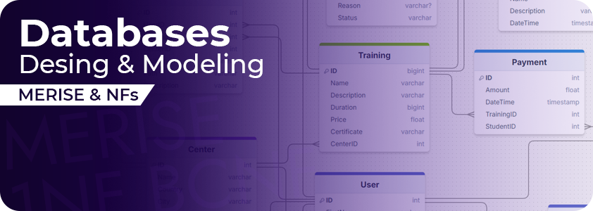
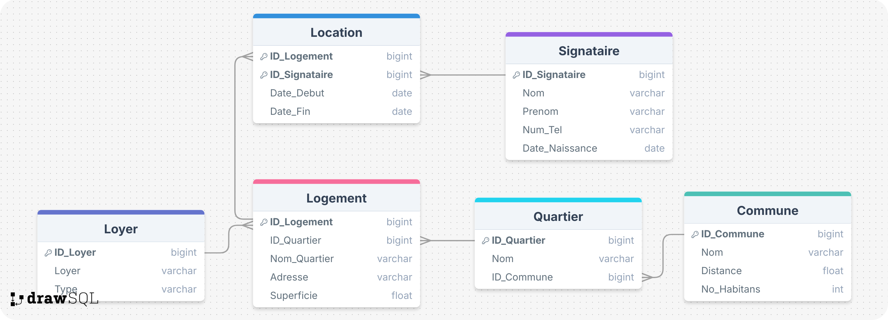

# Database Desing & Modeing

This repository is focused on applying database design principles, particularly the normalization process. The goal is to design efficient and well-structured relational databases that minimize redundancy and ensure data integrity. These exercises will guide you through the steps of database modeling, normalization, and the identification of functional dependencies.

## Details

The exrcices cover the following topics:

- **Normalization Forms:** Understanding and applying Normalization Forms (1NF, 2NF, 3NF, BCNF, 4NF, 5NF) to design relational databases.
- **Database Modeling:** Creating Entity-Relationship Diagrams (ERDs) to model the database.
- **Functional Dependencies:** Finding and identifying functional dependencies in the database, analyze their impact on the data, and design the database accordingly.
- **Data Types:** Choosing the appropriate data types for each attribute in the database to ensure efficient storage and retrieval of data.

## Demo

for the Data Modeling, I used DrawSQL website to create ERDs.

The Website offers apowerful features such as extracting the Data Model into various formats such as JSON, MySQL, PostgreSQL, SQL Sever and more.

In the figures below, I demostrate some examples of ERDs created using the SQL Draw Website

There are Other tools you can use such as PowerDesigner, JSoft for Drawing the Conceptual Data Model & Logical Data Models.

## 🔗 Links

